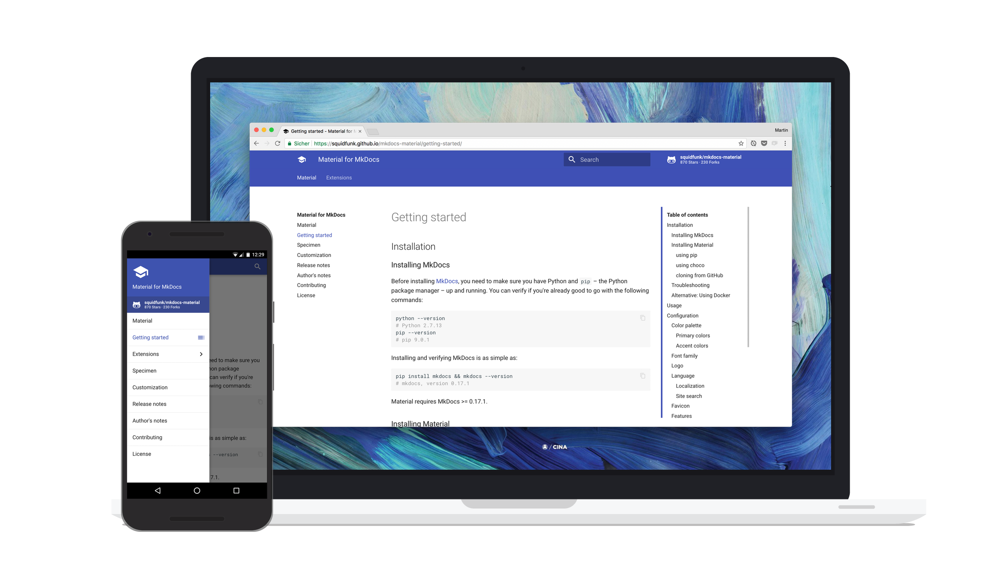

# MkDocs template

This repo contains the starter code and instructions to ***easily*** generate a static website built with `MkDocs`, with the additional potential to overlay it with themes

[][2]

  [2]: https://squidfunk.github.io/mkdocs-material/


## Generating new content
Generating new pages or content with `MkDocs` is extremely easy.

Simply write up a document in markdown, copy it over to the `docs` directory:

```
project folder
│
├── docs
│   ├── <page1>.md
│   └── <page2>.md
```

<br>
<br>

And then add the file and the page name you would like to give it in your `project-folder/mkdocs.yml` tree as shown below:
```md

nav:
  - Page name: markdownFileName.md
  - Grouping of Pages:
    - Grouping page 1: extensions/file1.md
    - Grouping page 2: extensions/file2.md

```
You are now ready to build and deploy! \
Instructions for that can be found in the next section.

<br>
<br>

## Setup your own MkDocs

**Hosting**

All files are static, this means not only can you have your website hosted on a regular web server but as well as free solutions such as [ReadTheDocs](https://readthedocs.org/) and [github-pages](https://pages.github.com/).

Follow the instructions in the following link in order to get started on learning howto build `mkdocs` project folders: 

https://mkdocs.readthedocs.io/en/stable/#mkdocs

<br> 

## Themes
> There are several good themes that are out there. If you got to their documentation they tell you how to install and customize them.


Here are my favorite themes that I've found so far:
* **squidfunk/mkdocs-material** - [link](https://squidfunk.github.io/mkdocs-material/)
  * Most robust theme I've seen so far. Makes it easy to change colors, and is both mobile and computer friendly.
* **Cinder Theme** - [link](https://sourcefoundry.org/cinder/)
* **lramage/mkdocs-gitbook-theme** - [link](https://gitlab.com/lramage/mkdocs-gitbook-theme)
  * this one has less documentation. I reccomend downloading the repo, `cd` into to it, run `pip install .`, the gitbook theme is now installed, you can delete the repo locally. The next time you build a new `mkdocs` directory change the `theme` value to `gitbook`.
* **bootswatch-simplex** - [link](https://mkdocs.github.io/mkdocs-bootswatch/#simplex)


> Please don't remove any of the copyrights, a lot of hard work was put in by the theme developers.

<br>

## Edit Themes
If you ever run into a scenario where you want to tweak a theme I recommend reading the "custom themes" portion of the mkdocs documentation.

Once you've done that clone a theme you like, and make your new mkdocs project use it as a custom theme. You never want to modify the `src` theme.

<br>
<br>

## Advice

If deploying to **Github Pages** I'd reccomend cloning the repo, switching to the gh-pages branch, doing your work in there, and then just running the `mkdocs gh-deploy --clean` command. It builds, cleans, and pushes for you.

Using `mkdocs serve` gives you a perfect sense of what your documentation will look like. But fair warning when you do `mkdocs build` don't try testing it by just clicking the html files, the paths for all of the links only work when it's being loaded by a web server.

<br>

<!-- ## License

This template was originally generated by **Martin Donath**, you can find their repo here: https://squidfunk.github.io/mkdocs-material/. 

Their license can be found here: https://squidfunk.github.io/mkdocs-material/license/. Please keep all **copyrights** as to credit the hard work. -->